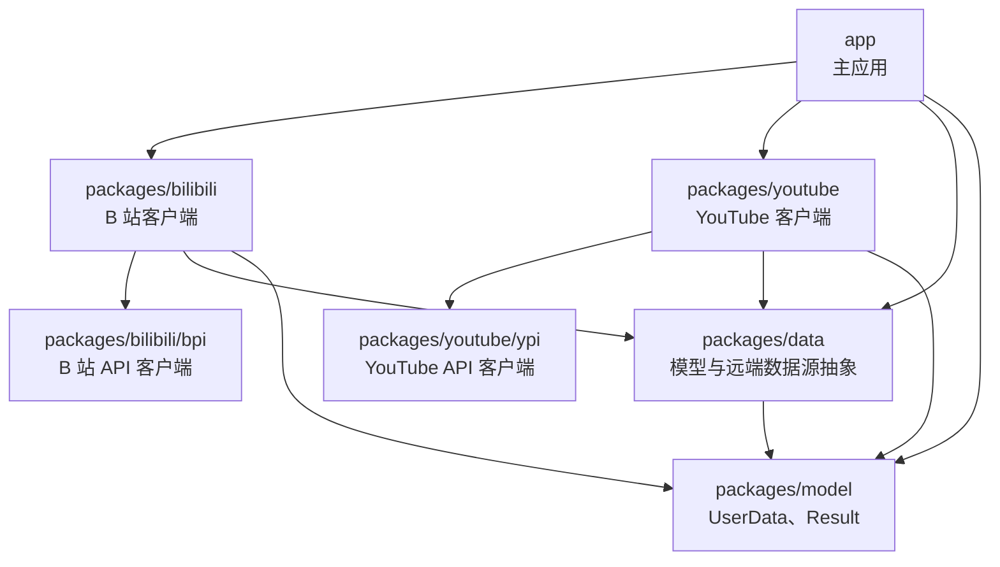

# bili 模块化学习旅程

面向第一次读这个仓库的贡献者。讲清三件事：仓库由哪些包组成、包之间允许怎么依赖、拆分边界是怎么划的。

和[架构学习旅程](architecture-learning-journey.md)配套：那份讲一次请求怎么走完，这份讲这些代码为什么分在不同包里。

## 1. 这个仓库是怎么组织的

bili 是一个 **pub workspace**，不是「一个 app 加几个随手放的文件夹」。

**官方**：pub workspace「把同一个版本控制仓库里的多个包组织成一个共享依赖解析的 monorepo」；`dart pub get` 在根目录生成**单一**的 `pubspec.lock` 和**单一**的 `.dart_tool/package_config.json`；成员 pubspec 需要 `resolution: workspace` 且 SDK 不低于 3.6.0（[Pub workspaces](https://dart.dev/tools/pub/workspaces)）。

根 `pubspec.yaml` 里：

```yaml
workspace:
  - app
  - packages/*
```

`packages/*` 是 glob（Dart 3.11 起支持），所以新增一个符合命名约定的包目录会被自动纳入，不需要改根文件。官方也支持嵌套 workspace——「一个 workspace 成员可以声明自己的 workspace 字段」，bili 的 `bpi` 与 `ypi` 就是这么放的。

官方还有一条对本仓库很实用的规定：workspace 内部互相依赖时，「无论来源如何，都会解析到 workspace 里的那一个」。所以 `packages/bilibili` 依赖 `bpi` 时，不需要写版本号，也不会意外拉到 pub.dev 上的同名包。

## 2. 实际的依赖图

下图是从每个包的 `pubspec.yaml` 里读出来的真实依赖关系，箭头指向被依赖方：



## 3. 包一览

| 包 | 职责 | 关键类型 |
|---|---|---|
| `packages/model` | 跨服务共享的数据模型与 `Result<T>`；不依赖任何内部包 | `UserData`、`Result<T>`、`Ok<T>`、`Error<T>` |
| `packages/data` | 业务模型与远端数据源的能力接口；只依赖 `model` | `RemoteDataSource`、`SearchRemoteDataSource`、`VideoDetailRemoteDataSource` |
| `packages/bilibili/bpi` | B 站 API 客户端：Chopper 抽象接口 + 代码生成 + 业务信封打解 + fixture 抓取脚本 | `@ChopperApi` 标注的服务类、`envelopeFactories`、`tool/capture/` |
| `packages/youtube/ypi` | YouTube API 客户端；额外有 Protobuf 编码 | InnerTube 端点、`YoutubeProtobufEncoder` |
| `packages/bilibili` | B 站客户端的上层封装：l10n、`RemoteDataSource` 实现 | `BiliPopularVideoFeedRemoteDataSource`、`BiliVideoDetailRemoteDataSource` |
| `packages/youtube` | YouTube 客户端的上层封装 | `YouTubeRemoteDataSource`、`YouTubeVideoSearchRemoteDataSource` |
| `app` | 主应用：UI、路由、领域用例、本地数据库、依赖注入 | `HomeBloc`、`AppDatabase`、`GoRouter` |

## 4. 依赖方向规则

**这三条是本仓库自定的规则，不是 Dart 官方条文。** 查证过 Effective Dart（新版拆成 Style / Documentation / Usage / Design / Packages 五页，Packages 页讲的是怎么建包、怎么发布，没有方向性禁令）、pub 官方三篇（dependencies / pubspec / workspaces）和 Flutter 架构指南（只讲 app 内的 MVVM 分层），都没有「底层包不得依赖上层包」这种表述。同构的官方说法只在 Android 那边有——`developer.android.com/topic/modularization` 的「modules should only depend on modules in the layer below」。

所以下面是约定，不是引文：

- **`model` 不得依赖任何内部包。** 它是最底层，被所有层引用，一旦反向依赖就形成环。
- **`data` 只依赖 `model`。** 它定义能力接口，不认识任何具体服务。
- **`bpi` / `ypi` 不得依赖 `data` 或其他服务包。** 它们是纯 API 客户端，只知道 HTTP 和业务信封。
- **`app` 可以依赖一切；其他包之间只允许沿上图方向。** 离线包（A 站与 YouTube）彼此不认识。

最后一条不是洁癖：bpi 与 ypi 各自的 `AGENTS.md` 里有独立的抓取脚本、fixture 目录与测试约定，混在一起会让「改一个服务的行为会不会影响另一个」这个问题无法回答。

## 5. 为什么这么切

**能力接口放在 `data`，实现在服务包。** `data` 里的 `VideoDetailRemoteDataSource` 是一个抽象接口，声明「这个服务能取视频详情」。`bilibili` 里的实现类满足它。app 层的仓库只面向接口编程，于是「当前服务支不支持视频详情」这个问题在数据层内部解决，不需要 app 知道。

**API 客户端与服务封装分成两个包。** `bpi` 只管把 HTTP 响应变成 Dart 对象——Chopper 抽象接口、代码生成、业务信封打解、fixture 抓取。`bilibili` 在上面加一层，做模型映射、l10n、错误归一化。分开的理由是它们的变更原因不同：接口变了动 `bpi`，产品行为变了动 `bilibili`。

**`model` 单独一层。** `UserData` 和 `Result<T>` 被 app、`data`、两个服务包同时引用。放在任何一个包里都会让那个包被不该依赖它的人依赖。

## 6. 测试与模块的对应关系

**官方**：Flutter 把测试分三类——unit test「测单个函数、方法或类，被测对象的外部依赖一般被 mock 掉，不读写磁盘、不渲染屏幕、不接收进程外的用户动作」；widget test「测单个 widget，验证界面看起来和交互起来符合预期」；integration test「测完整应用或应用中很大的一部分，验证被测的各个组件与服务一起工作」（[Testing overview](https://docs.flutter.dev/testing/overview)）。

本仓库的对应关系：

| 层 | 测试类型 | 放在哪 | 关键前提 |
|---|---|---|---|
| `app` 的 bloc、仓库、DAO | unit | `app/test/` | 用 `NativeDatabase.memory()`；Drift 数据库套件是纯 Dart 测试，不初始化 Flutter binding |
| `app` 的界面 | widget | `app/test/` | provider 树要与生产一致，bloc 在 `testWidgets` 内构造 |
| 已覆盖组件的渲染 | golden | `app/test/golden/` | alchemist CI goldens，详见下一节 |
| `bpi` / `ypi` | unit + fixture | 各包 `test/` | 离线，用 `MockClient` 与 `testing/*.json`；**必须从包目录跑** |
| `bilibili` / `youtube` | unit | 各包 `test/` | 同上 |

**包级测试有一条容易踩的坑**：`bpi` 的 fixture 用相对路径读 `testing/<endpoint>.json`，从仓库根目录跑会失败。必须 `cd packages/bilibili/bpi && flutter test test/`。

## 7. 截图测试为什么不用原生 golden

**官方原文**（[matchesGoldenFile 的 Including Fonts 一节](https://api.flutter.dev/flutter/flutter_test/matchesGoldenFile.html)）：

> Custom fonts may render differently across different platforms, or between different versions of Flutter. For example, a golden file generated on Windows with fonts will likely differ from the one produced by another operating system. Even on the same platform, if the generated golden is tested with a different Flutter version, the test may fail and require an updated image.

同一页还说明，flutter_test 默认用 Ahem 字体（把每个字符画成实心方块），并给了用 `FontLoader` 在 `flutter_test_config.dart` 里加载固定字体的做法。

本仓库没有启用原生 `platform goldens`，因此用 alchemist 的 CI goldens 作为跨平台基线：CI goldens 走 Ahem 字体并把文字遮蔽成纯色块，`app/test/flutter_test_config.dart` 把 `platformGoldens` 设为 `false`、`diffThreshold` 设为 `0.01`。

这是本仓库的选择，不代表原生 golden 加载固定字体后就无法共享一张基线 PNG——官方文档给的就是 `FontLoader` 这条路。要注意的是 `0.01` 是**比较容差**：截图测试通过不等于逐像素相等。

## 8. 演进说明

这份文档描述的是当前的切分方式，不是唯一正确答案：

- 粒度会随规模变化。`data` 和 `model` 现在都很小，如果它们继续各自只有一个文件，合并成一个包会让依赖图少一层。
- **原本的 `packages/components` 已并入 `app`**（2026-09-27）。它此前没有任何包依赖、全仓也没有一处 `import 'package:components/...'`，作为独立包没有存在价值；`ToggleSwitchComponent` 落到 `app/lib/ui/common/`，`Motion` 落到 `app/lib/design/`。并入后两者仍无引用者——共享控件的归属由它实际的调用方决定，等有了调用方再谈是否值得独立成包。
- **包级测试目前不在 CI 里跑。** CI 的测试步骤只有 `cd app && flutter test`。这四个包合计 81 个用例，改包之后必须本地跑过才算完。
- 加新服务要动五处：新建 `packages/<service>/pubspec.yaml` 写 `resolution: workspace`；在 `packages/data` 加能力接口；在 `packages/<service>` 实现；若另有 API 客户端子包（如 `bpi`），在 `packages/<service>/pubspec.yaml` 里加嵌套 `workspace:` 把子包纳入；在 `app/pubspec.yaml` 加一条 path 依赖，并在 app 的服务清单里注册。**根 `pubspec.yaml` 的 `packages/*` 只覆盖顶层包**——glob 不递归，新包不需要动根文件，但子包要靠父包的嵌套声明。

## 9. 延伸阅读

- [Pub workspaces](https://dart.dev/tools/pub/workspaces) —— workspace 机制、嵌套、共享解析
- [Package dependencies](https://dart.dev/tools/pub/dependencies) —— 直接依赖、path dependency 的边界
- [Testing overview](https://docs.flutter.dev/testing/overview) —— 三类测试的官方定义
- [matchesGoldenFile](https://api.flutter.dev/flutter/flutter_test/matchesGoldenFile.html) —— 跨平台渲染差异的官方原文
- [Flutter 架构指南](https://docs.flutter.dev/app-architecture/guide) —— app 内分层

## 10. 未能核实的说法

- 「底层包不得依赖上层包」——Dart/Flutter 官方文档里**没有**这条条文，是本仓库自定规则。最接近的官方表述在 Android 侧，见第 4 节。
- Chopper 与 Protobuf 组合的官方示例未找到，Chopper 官方只文档化了 Converters 机制本身。
